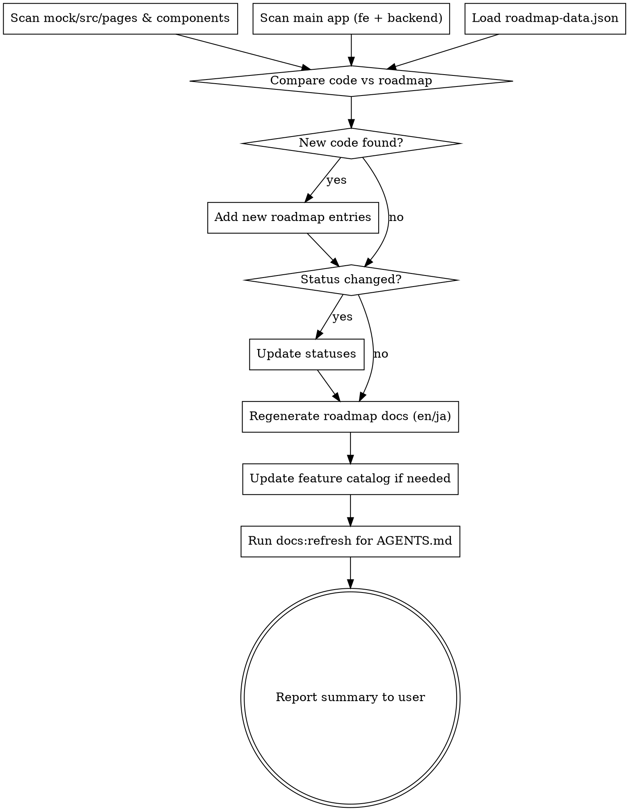

# Docs Update Audit

On-demand audit that scans source code in both `mock/` and the main app, compares against product documentation, and updates everything to stay in sync.

## Status Labels

| Status | Meaning | Detection Signal |
|--------|---------|-----------------|
| `released` | Shipped to production | Code on master in main app |
| `in-development` | Actively being built | Code in progress in main app |
| `design` | Mock/prototype exists | Pages/components in `mock/src/` |
| `planning` | Scoped, no code yet | In roadmap data only |
| `requirements-defined` | Requirements written | Existing roadmap status |
| `requirements-in-progress` | Defining requirements | Existing roadmap status |
| `on-hold` | Blocked | Existing roadmap status |
| `not-started` | Backlog | Existing roadmap status |

## Audit Process



## Step-by-Step Instructions

### 1. Scan Source Code

**Mock UI** — scan for pages and significant components:
```
mock/src/pages/**/*.tsx        → each subfolder = a feature area
mock/src/components/**/*.tsx   → shared/new components
mock/feature/                  → feature design docs
```

**Main App** — scan for services, routes, pages, and components:
```
apps/workforce-fe/src/app/(workforce)/**/page.tsx   → frontend pages
apps/workforce-fe/src/components/*/                 → component groups
apps/workforce-backend/src/**/*.service.ts          → backend services
packages/api-contract/src/resources/*.ts            → API contracts
```

### 2. Load & Compare Roadmap Data

Read `docs/product/roadmap-data.json`. For each code artifact found:

1. **Check `mockPaths` and `codePaths`** in existing items for matches
2. **Check item `id` and `name`** for semantic matches (e.g., `mock/src/pages/projects/ContractDetail.tsx` matches item `project-contract-restructure`)
3. **Unmatched code** = potential new roadmap entry

### 3. Detect Status Changes

Apply this status flow based on where code exists:

```
planning → design (mock pages exist)
design → in-development (main app code exists)
in-development → released (merged to master, stable)
```

**Do NOT downgrade statuses.** Only upgrade (e.g., `design` → `in-development`, never the reverse).

### 4. Add New Roadmap Entries

For unmatched code, create a new entry in `roadmap-data.json`:

- **`id`**: kebab-case derived from the feature name
- **`name`**: bilingual `{ en, ja }` — infer from component names, page titles, or i18n keys
- **`status`**: `design` if only in mock, `in-development` if in main app
- **`horizon`**: `now` if actively being built, `next` otherwise
- **`category`**: infer from the code location (projects → core-platform, AI → workforce-intelligence, etc.)
- **`mockPaths` / `codePaths`**: actual file paths found
- **`notes`**: brief description in both languages

**Always confirm new entries with the user before writing.**

### 5. Regenerate Roadmap Docs

Run the roadmap generator to produce updated markdown:

```bash
./helper.sh docs:roadmap
```

This regenerates:
- `docs/en/product/roadmap.md`
- `docs/ja/product/roadmap.md`

Both files are generated from `docs/product/roadmap-data.json` and should NOT be hand-edited.

### 6. Update Feature Catalog (if needed)

If new features were added or statuses changed significantly, update:
- `docs/en/product/feature-catalog.md`
- `docs/ja/product/feature-catalog.md`

Match the existing format (attribute tables per feature).

### 7. Update Changelog (if needed)

If items moved to `released` status, add entries to:
- `docs/en/product/changelog.md`
- `docs/ja/product/changelog.md`

### 8. Run AGENTS.md Refresh

If any structural changes were detected (new services, routes, components, migrations):

```bash
./helper.sh docs:refresh
```

### 9. Report Summary

Present a summary table to the user:

```markdown
## Docs Audit Summary

| Action | Item | Details |
|--------|------|---------|
| NEW    | vendor-list | Mock page found at mock/src/pages/vendors/ |
| UPDATE | project-contract-restructure | design → in-development |
| SKIP   | sidebar-redesign | No status change |

Files updated:
- docs/product/roadmap-data.json
- docs/en/product/roadmap.md
- docs/ja/product/roadmap.md
- AGENTS.md (via docs:refresh)
```

## Key Rules

- **Bilingual always** — every new entry needs both `en` and `ja` names and notes
- **Never downgrade status** — only move forward in the status flow
- **Confirm before adding** — show user proposed new entries before writing
- **Preserve hand-written content** — roadmap docs are generated, but feature catalog and changelog may have hand-written sections
- **Date tracking** — update `lastUpdated` in roadmap-data.json to today's date
